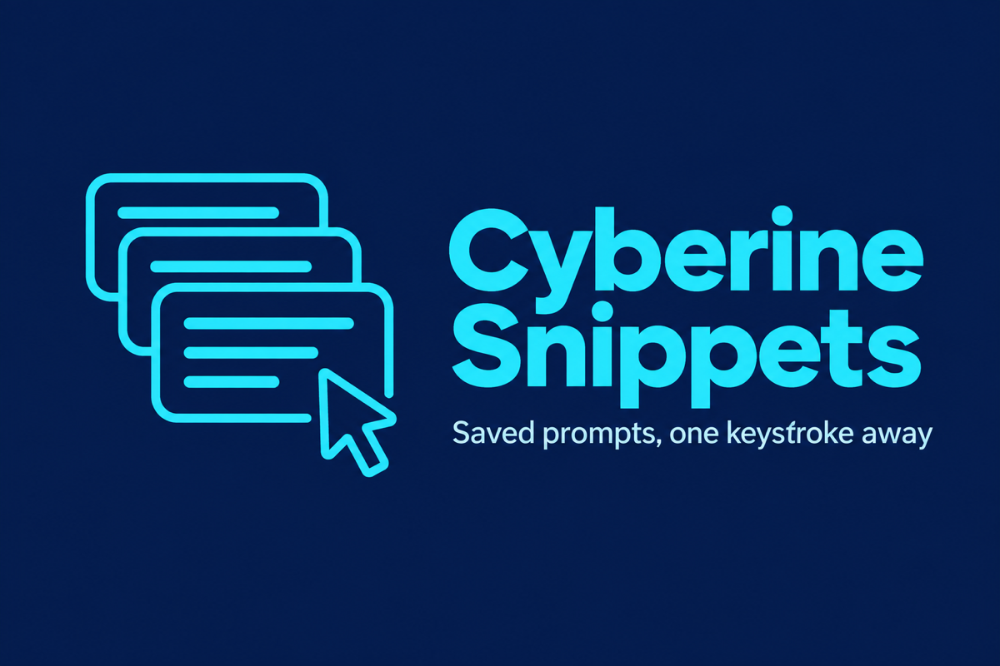
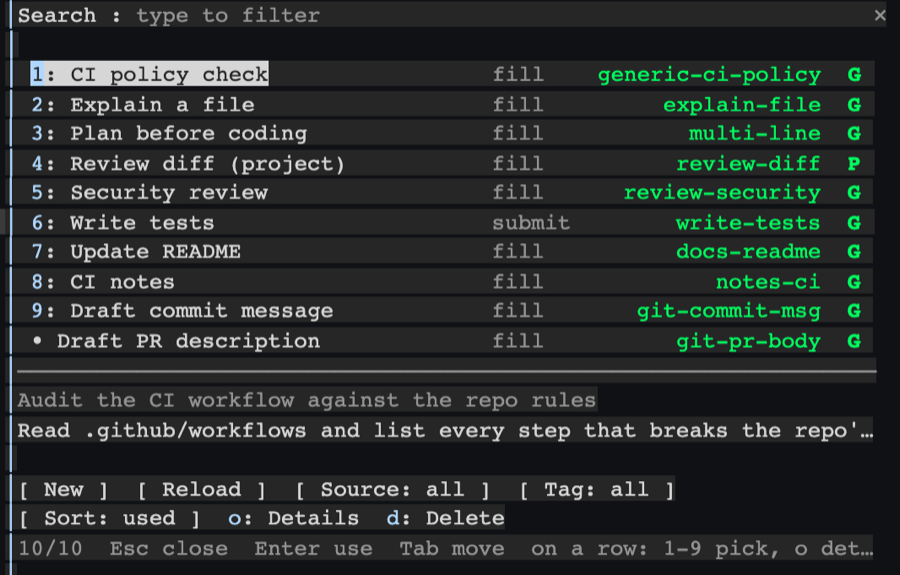
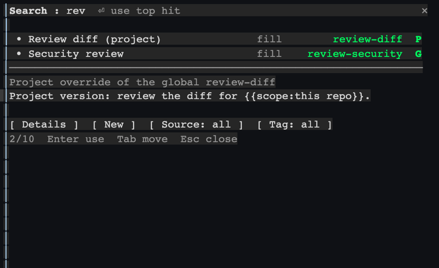
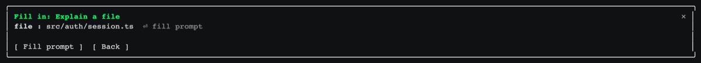
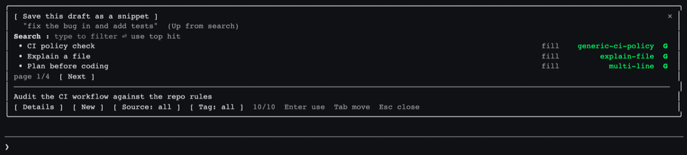
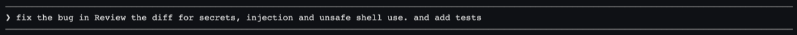
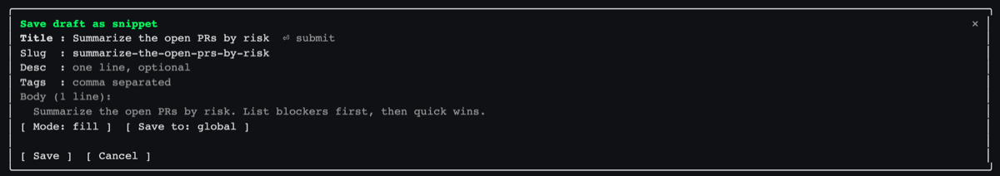
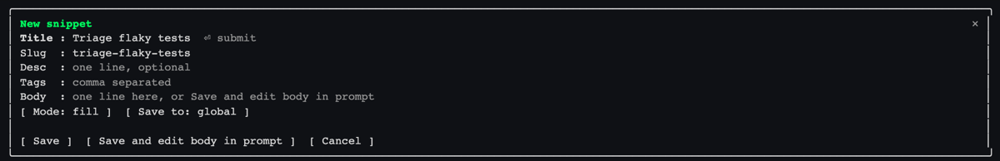
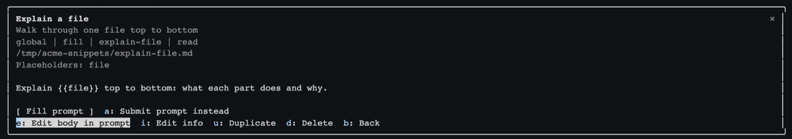

# Cyberine Snippets



A Claude Code plugin that keeps your saved prompts as plain Markdown files and puts them in the prompt box from a keyboard picker. Type `/snippets` (or the short `/sn`), or `;;` anywhere in a prompt you are writing, find a snippet, press Enter. Snippets are files, not skills, so they cost the model no context until you use one, and you can create, edit, duplicate and delete them without leaving the session.

Requires Claude Code 2.1.287 or newer. The plugin is a mod (function hooks), which loads in the terminal and in the Desktop app's Code tab. The VS Code chat panel and `claude -p` run its commands but draw no pane, so use `/sn list` there.





## Install

```
/plugin marketplace add cyberinecore/cc-snippets
/plugin install cyberine-snippets@cyberine-snippets
```

To try a local checkout for one session instead:

```
claude --plugin-dir /path/to/cc-snippets
```

## Snippet files

- Global: `~/.claude/snippets/**/*.md`. Set `CYBERINE_SNIPPETS_DIR` to use another folder.
- Project: `<repo root>/.claude/snippets/**/*.md`. A project snippet replaces a global one with the same slug.
- Files and folders whose names start with a dot are ignored, which is where `.trash` lives.

```markdown
---
title: Review current diff
desc: Merge blockers only, file:line
tags: [review, git]
mode: fill
---
Review the diff against {{base:main}} and report only merge blockers for {{scope}}.{{cursor}}
```

| Field | Required | Meaning |
|---|---|---|
| `title` | yes | Shown in the picker |
| `slug` | no | Defaults to the file name without `.md`; usage counts and `/sn <query>` match on it |
| `desc` | no | One line shown under the title |
| `tags` | no | `[a, b]` or a block list; searchable and filterable |
| `mode` | no | `fill` (default) puts the text in the prompt box; `submit` sends it to Claude at once |

Placeholders in the body:

- `{{name}}` asks for a value before applying.
- `{{name:default}}` asks with the default prefilled; an empty answer keeps the default.
- `{{cursor}}` marks where you continue typing. Claude Code gives plugins no way to move the caret, so the plugin redirects the first key you type after the fill to that mark.

A file that fails to parse is skipped and listed by `/sn doctor`; it never stops the rest from loading.

## Using the picker

### Find and use a snippet

`/snippets` (or `/sn`) opens the pane with the search field focused. Typing filters by title, slug, tags and description; a slug segment prefix ranks high, so `ci` finds `generic-ci-policy` first. With an empty search the most-used snippets come first. Each result is one line: the title, its mode, its slug and `G` (global) or `P` (project); below a divider the focused snippet previews.

Down or Tab moves from the search field to the results; Enter on a result applies it, and Enter in the search field applies the top hit. A `fill` snippet lands in the prompt box and the pane closes; a second Enter then sends it to Claude as with anything you type, so review it first. A `submit` snippet is sent at once.

### Fill placeholders

A snippet with `{{name}}` or `{{name:default}}` asks for the values first. Enter moves to the next field; the last Enter applies.



### Insert into the prompt you are writing

Type `;;` where the snippet should go. The plugin holds your draft, opens the picker, and puts the draft back with the snippet inserted at that spot; a `submit` snippet is inserted too, never sent. Esc gives the draft back unchanged. `/snippets` itself starts from an empty prompt box, since typing a command replaces what the box held.





### Save the prompt you are writing as a snippet

Type `;;` in the draft, press Up once from the search field, and choose "Save this draft as a snippet". The form takes the title from the draft's first sentence and derives the slug from it; the body is the draft. Save writes the file and puts your draft back in the prompt box, so you can still send it.



### Create and manage snippets

New (or `/snippets new`) opens the form; the slug follows the title until you edit it. New snippets go to the global folder; the Save to button switches to the project folder.



Details shows the whole snippet and its actions, each with a letter key: `a` apply the other way (fill instead of submit or back), `e` edit the body in the prompt box, `i` edit title, slug, description, tags and mode, `u` duplicate, `d` delete, `b` back.



Editing a body: the plugin puts the body into the prompt box and the status line says so. Change it there (multi-line works as usual), then press Enter: the text is saved to the snippet file instead of being sent to Claude. `/snippets cancel`, or clearing the prompt box, stops editing without saving. Slash commands typed while editing still run.

Esc closes the pane on every screen. On a short terminal the list, pager and buttons keep their rows and the preview gives way.

## Commands

| Command | Does |
|---|---|
| `/snippets` or `/sn` | Open the picker (`/snippets` is the full name; `/sn` is the short alias, and every row below works with either) |
| `/sn <query>` | Open the picker pre-filtered |
| `/sn new [slug]` | Create a snippet |
| `/sn cancel` | Stop editing a snippet body in the prompt box |
| `/sn reload` | Re-read the snippet folders |
| `/sn list` | Print `slug - title` per snippet |
| `/sn doctor` | Print folders, skipped files and duplicate slugs |

## What it reads, writes and runs

- Reads the snippet folders above, the `HOME` and `CYBERINE_SNIPPETS_DIR` environment variables, and the prompt box draft while you apply a snippet or save an edited body. It watches the keys you type in the prompt box only to spot `;;` and to place the caret after a fill. It never reads your conversation, Claude's memory or chat history.
- Writes snippet files you create or edit. A save checks the file has not changed on disk since it was loaded and never overwrites another snippet.
- Runs `mkdir -p` and `mv -n` (fixed arguments, no shell) to move deleted and renamed snippets into a `.trash` folder in their snippet folder, and `rm -f` on its own temporary file if a create loses a race.
- Keeps a per-slug usage count in the plugin's own Claude Code store to order results.
- Sends nothing anywhere. See `PRIVACY.md`.

## Troubleshooting

- `/sn` does nothing or is unknown: run `/plugin` and check that the plugin's mod is active. The debug log line "hooks modules are turned off for installed plugins in this process: the rollout switch served off" means Anthropic has turned installed mods off remotely for that launch; built-in mods still load and there is nothing to fix locally. Restart Claude Code later.
- A snippet is missing: run `/sn doctor`, fix the file, then `/sn reload`.
- "changed on disk since it was loaded": another editor changed the file; run `/sn reload` and repeat the edit.
- Text did not land in the prompt: the box refuses fills while another dialog holds the keys; close it and pick again.

## Develop

```
npm test                                   # packaging rules
claude plugin validate . --strict
claude plugin validate .claude-plugin/plugin.json --strict
claude plugin test .                       # unit and pane tests
```

`hooks/register.tsx` holds every hook and every function that touches the engine, because the engine only follows `$` within one file. Pure logic lives in `src/` (parsing, placeholders, search, caret), and every visual constant the pane uses is in `src/look.ts`.

## License

MIT, see `LICENSE`.
