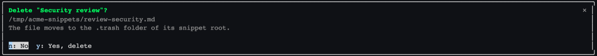
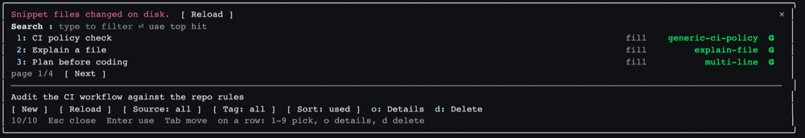

# Cyberine Snippets


A Claude Code plugin that keeps your saved prompts as plain Markdown files and puts them in the prompt box from a keyboard picker. Type `/snippets` (or the short `/sn`), or `;;` anywhere in a prompt you are writing, find a snippet, press Enter. Snippets are files, not skills, so they cost the model no context until you use one, and you can create, edit, duplicate, move, pin, delete and restore them without leaving the session.

Requires Claude Code 2.1.287 or newer. The plugin is a mod (function hooks), which loads in the terminal and in the Desktop app's Code tab. The VS Code chat panel and `claude -p` run its commands but draw no pane, so use `/sn list` there.


## Install

```
/plugin marketplace add cyberinecore/cc-snippets
/plugin install cyberine-snippets@cyberine-snippets
```

Or from a shell, outside a session:

```
claude plugin marketplace add cyberinecore/cc-snippets
claude plugin install cyberine-snippets@cyberine-snippets
```

To try a local checkout for one session instead:

```
claude --plugin-dir /path/to/cc-snippets
```

## Snippet files

- Global: `~/.claude/snippets/**/*.md`. Set `CYBERINE_SNIPPETS_DIR` to use another folder.
- Project: `<repo root>/.claude/snippets/**/*.md`. A project snippet replaces a global one with the same slug.
- Files and folders whose names start with a dot are ignored, which is where `.trash` lives. Subfolders are read up to 6 levels deep, and at most 2000 files are read from each snippet folder.

```markdown
---
title: Review current diff
desc: Merge blockers only, file:line
tags: [review, git]
mode: fill
---
Review the diff against {{base:main}} and report only merge blockers for {{scope}}.{{cursor}}
```

| Field | Required | Meaning |
|---|---|---|
| `title` | yes | Shown in the picker |
| `slug` | no | Defaults to the file name without `.md`; usage counts, search and `/sn <slug>!` use it |
| `desc` | no | One line shown in Details and above the preview |
| `tags` | no | `[a, b]` or a block list; searchable and filterable |
| `mode` | no | `fill` (default) puts the text in the prompt box; `submit` sends it to Claude at once |
| `pin` | no | `true` puts the snippet first in the list, after the search score; pinned snippets keep the order you give them with `k` and `j` |

Placeholders in the body:

- `{{name}}` asks for a value before applying.
- `{{name:default}}` asks with the default prefilled; an empty answer keeps the default.
- `{{date}}` and `{{time}}` fill themselves with the local date (YYYY-MM-DD) and time (HH:MM); they are never asked.
- `{{cursor}}` marks where you continue typing. Claude Code gives plugins no way to move the caret, so the plugin redirects the first key you type after the fill to that mark.

A file that fails to parse is skipped and listed by `/sn doctor`; it never stops the rest from loading.

## Using the picker

### Find and use a snippet

`/snippets` (or `/sn`) opens the pane with the search field focused. Typing filters by title, slug, tags and description; a slug segment prefix ranks high, so `ci` finds `generic-ci-policy` first. Among equal matches, and for an empty search, pinned snippets come first in the order you set, then the most used ones (or the most recently used, see Sort below).

Below the search field come the results, one line each: the title, its mode, its slug, and `G` (global) or `P` (project), with `*` when pinned. Below a divider the focused snippet previews. Then sits the tools row: New, Reload, Source (all, global, project), Tag (the tags of the snippets the Source filter shows), Sort (most used or most recently used; the choice is remembered), and Details, Delete and Pin (or Unpin) for the focused result, plus Up and Down when it is pinned. The bottom line shows the counts and keys.

Down or Tab moves from the search field to the results, so the most used snippet is one key away, and on through the tools row. Enter on a result applies it, and Enter in the search field applies the top hit. Once the focus has left the search field, `1` to `9` apply the first nine rows, `o` opens the details of the focused result, `d` deletes it, `p` pins or unpins it, and on a pinned result `k` moves it up and `j` down among the pinned ones you can see; while the search field has the focus, these keys are typed into the search.

A `fill` snippet lands in the prompt box and the pane closes; a second Enter then sends it to Claude as with anything you type, so review it first. A `submit` snippet is sent at once.

When you know the slug, `/sn <slug>!` skips the picker: the snippet is applied at once, a snippet with placeholders opens its form, and an unknown slug opens the picker filtered by that text.

A page shows 10 results by default; `/sn rows <n>` sets it from 3 to 30 and the choice is remembered, and the pane asks Claude Code for enough rows to fit that page. Esc closes the pane on every screen. When the pane is short, the preview is dropped first; when Claude Code gives the pane fewer rows than it asks for, the bottom is cut (the counts line, the tools row, then the preview and the end of the list), while the search field stays.

### Fill placeholders

A snippet with `{{name}}` or `{{name:default}}` asks for the values first. Enter moves to the next field; the last Enter applies. The next time you use that snippet, the form starts from the values you typed last.


### Insert into the prompt you are writing

Type `;;` where the snippet should go. The plugin holds your draft, opens the picker, and puts the draft back with the snippet inserted at that spot; a `submit` snippet is inserted too, never sent. Esc gives the draft back unchanged. `/snippets` itself starts from an empty prompt box, since typing a command replaces what the box held.


### Save the prompt you are writing as a snippet

Type `;;` in the draft, press Up once from the search field, and choose "Save this draft as a snippet". The form takes the title from the draft's first sentence and derives the slug from it; the body is the draft. Save writes the file and puts your draft back in the prompt box, so you can still send it.


### Create and manage snippets

New (or `/sn new`) opens the form; the slug follows the title until you edit it. New snippets go to the global folder; the Save to button switches to the project folder. A slug that is already taken in that folder is refused, with a free `-2` style slug suggested.


Details shows the whole snippet. Enter applies it in its own mode; the other actions have a letter key: `a` applies it in the other mode (fill a `submit` snippet, or submit a `fill` one), `e` edits the body in the prompt box, `i` edits title, slug, description, tags and mode, `u` duplicates, `m` moves, `p` pins or unpins (writes or removes `pin: true` in the file), `d` deletes, `b` goes back to the list with the focus on that snippet's row.


Editing a body: the plugin puts the body into the prompt box and the status line says so. Change it there (multi-line works as usual), then press Enter: the text is saved to the snippet file instead of being sent to Claude. `/sn cancel`, or clearing the prompt box, stops editing without saving. Slash commands typed while editing still run.

Move takes the snippet to another folder. To switches between global and project (when the session has a project folder), and Folder names a subfolder such as `team/daily` (letters, digits, `.`, `_` and `-`, each part starting with a letter or digit), or stays empty for the top level. The file keeps its name and content. A snippet with the same slug already in the target source, an existing file at the target, or a file changed on disk since it was loaded stops the move.

Delete, from Details (`d`), from the Delete button, or with `d` on a result row, asks first: `y` deletes, `n` keeps it. The file moves to the `.trash` folder at the top of its snippet folder.



`/sn trash` lists what is in the `.trash` folders, newest first (up to 15 shown). Enter on one restores it to the top of its snippet folder as `<slug>.md`; if that file already exists, the restore is refused and nothing is overwritten.

Edits, renames, moves and deletes refuse a file that changed on disk since it was loaded; reload and repeat.

### Reload after editing files outside Claude

The picker keeps the snippets it loaded. When you open it, it compares the file names and modification times in the snippet folders with what it loaded, without reading the files, and if anything was added, changed or removed it says "Snippet files changed on disk" with a Reload button. The Reload button in the tools row and `/sn reload` re-read the folders at any time.



## Commands

| Command | Does |
|---|---|
| `/snippets` or `/sn` | Open the picker (`/snippets` is the full name; `/sn` is the short alias, and every row below works with either) |
| `/sn <query>` | Open the picker pre-filtered |
| `/sn <slug>!` | Apply the snippet with that exact slug without the picker |
| `/sn new [slug]` | Create a snippet, optionally with that slug |
| `/sn trash` | Restore a deleted snippet |
| `/sn cancel` | Stop editing a snippet body in the prompt box |
| `/sn reload` | Re-read the snippet folders |
| `/sn rows [n]` | Print or set the results per page, 3 to 30 (default 10) |
| `/sn list` | Print `slug - title` per snippet |
| `/sn doctor` | Print folders, skipped files and duplicate slugs |
| `/sn help` | Print this list |

## What it reads, writes, runs and sends

- Files it reads: the Markdown files in the snippet folders (`~/.claude/snippets`, or the folder in `CYBERINE_SNIPPETS_DIR`, and `<repo root>/.claude/snippets`), and the files in their `.trash` folders when you open `/sn trash`. It reads the `HOME` and `CYBERINE_SNIPPETS_DIR` environment variables only to find the global folder. It reads no other file.
- What it puts in a prompt it submits (`prompt.submit`): only the text of a snippet you picked whose `mode` is `submit`, with the placeholder values you typed, after you chose it. It never adds the content of any other file, the conversation or your draft.
- The prompt box (`prompt.read`, `prompt.fill`): it reads the draft only to insert a snippet at your caret, to hold the draft while the `;;` picker is open, and to save a draft or an edited body as a snippet file. The draft goes back into the prompt box or into that snippet file, nowhere else. While a body edit or a held draft is active, Enter in the prompt box saves or is held back instead of sending. It never reads the conversation transcript, Claude's memory or chat history.
- Files it writes (`fs.write`): only snippet `.md` files inside the snippet folders above: a snippet you create, edit, pin, move or restore, and the copy of a deleted or renamed snippet in the `.trash` folder of its snippet folder. Every write and removal is checked to stay inside those folders; it never writes build, start-up, settings or instruction files.
- Programs it runs (`process.run`): one program, `rm -f -- <file>`, with a fixed program name and no shell. It runs only after the snippet's text was copied to its new place (the `.trash` folder, the folder you moved it to, or back out of `.trash`), to remove the file it was copied from when you delete, rename, move or restore a snippet; the path is always a snippet file inside the snippet folders. Claude Code's file API has no delete, which is why it is needed. It sends nothing anywhere.
- Hooks it registers, and what each does:
  - `session.start`: registers `/snippets` and `/sn` and loads the snippet folders.
  - `command.run` for `/snippets` and `/sn`: runs the subcommands above.
  - `ui.render` and `ui.focus` for its own pane only: draws the picker and remembers which result is focused, for the preview and for `o`, `d`, Details and Delete.
  - `ui.close`: when its own pane closes while a `;;` draft is held, puts that draft back in the prompt box. It ignores every other pane.
  - `prompt.edit`: notices `;;` in the prompt box, and redirects the first keystroke after a fill to the `{{cursor}}` mark. Every other edit passes through unchanged.
  - `prompt.submit`: only while you are editing a snippet body, or while the picker holds a `;;` draft, Enter in the prompt box saves the body or is held back instead of sending; every other prompt passes through unchanged.
- What it stores, in the plugin's own Claude Code store: a per-slug usage count and time of last use, to order results; the sort choice; the results per page; the order of pinned snippets, by file path; and the placeholder values you last typed per snippet, to prefill the form. Placeholder values are whatever you typed, so keep secrets out of placeholders.
- What it sends off the machine: nothing. It has no network code. See `PRIVACY.md`.

## Troubleshooting

- `/sn` does nothing or is unknown: run `/plugin` and check that the plugin's mod is active. The debug log line "hooks modules are turned off for installed plugins in this process: the rollout switch served off" means Anthropic has turned installed mods off remotely for that launch; built-in mods still load and there is nothing to fix locally. Restart Claude Code later.
- A snippet is missing: run `/sn doctor`, fix the file, then `/sn reload`.
- "changed on disk since it was loaded": another editor changed the file; press Reload in the picker (or run `/sn reload`) and repeat the edit.
- Text did not land in the prompt: the box refuses fills while another dialog holds the keys; close it and pick again.
- Claude cannot create a snippet for you ("is in another repository" or a similar block): a guard such as a cross-repository write hook stops Claude's own Write tool when the snippet folder sits inside another git repository, for example a `~/.claude` kept in git. The plugin's own saves are not affected. Write the text in the prompt box, type `;;`, press Up and choose "Save this draft as a snippet"; or point `CYBERINE_SNIPPETS_DIR` at a folder outside any repository, such as `~/.local/share/cyberine-snippets`.

## Develop

```
npm test                                   # packaging rules
claude plugin validate . --strict
claude plugin validate .claude-plugin/plugin.json --strict
claude plugin test .                       # unit and pane tests
```

`hooks/register.tsx` holds every hook and every function that touches the engine, because the engine only follows `$` within one file. Pure logic lives in `src/` (parsing, placeholders, search, caret), and every visual constant the pane uses is in `src/look.ts`.

## License

MIT, see `LICENSE`.
